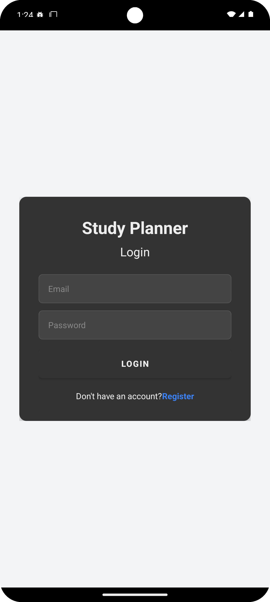
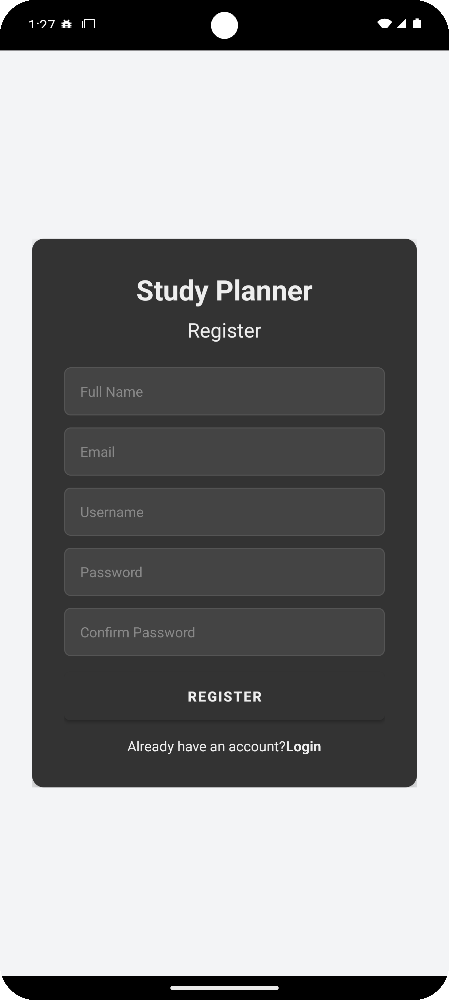
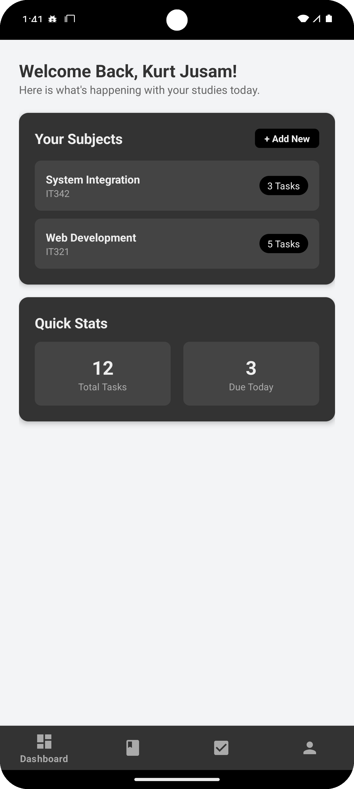
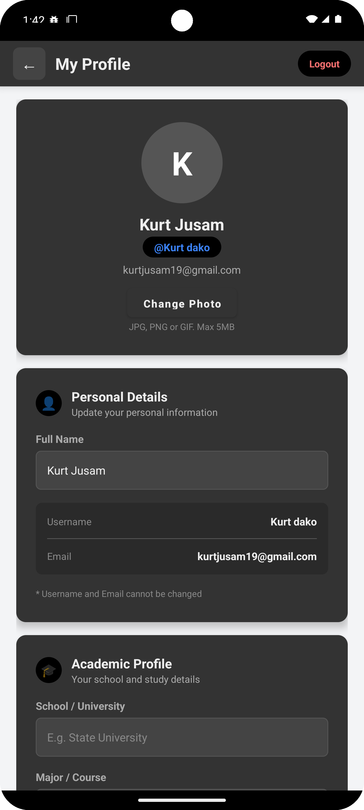

# 📱 Study Planner Mobile






An Android mobile application built with **Kotlin** that mirrors the web-based Study Planner system. The app integrates with a backend API using **Retrofit** and implements full authentication with **JWT Bearer Tokens**.

---

## 🎯 Features

| Feature | Description |
|---------|-------------|
| **Register** | Create a new account with full name, email, username, and password |
| **Login** | Authenticate with email and password, receive JWT token |
| **Dashboard** | View welcome message, subjects list, and quick stats |
| **Profile** | View and edit profile with avatar, personal details, and academic info |
| **Update Profile** | Edit full name, school, major, and bio |
| **Change Password** | Update password with current password verification |
| **Upload Avatar** | Change profile photo from device gallery |
| **Logout** | Clear session and return to login screen |

---

## 🛠️ Tech Stack

| Technology | Purpose |
|-----------|---------|
| **Kotlin** | Primary programming language |
| **Retrofit 2.9.0** | HTTP API client for network requests |
| **Gson 2.10.1** | JSON serialization/deserialization |
| **OkHttp 4.12.0** | HTTP client with logging interceptor |
| **Glide 4.16.0** | Image loading and caching |
| **CircleImageView 3.1.0** | Circular avatar display |
| **Material Design** | Bottom navigation and UI components |
| **ViewBinding** | Type-safe view references |
| **SharedPreferences** | Local session/token storage |

---

## 📁 Project Structure

```
StudyPlannerMobile/
├── settings.gradle
├── build.gradle                              # Project-level config
├── gradle.properties
├── gradle/wrapper/gradle-wrapper.properties
├── app/
│   ├── build.gradle                          # App dependencies
│   ├── proguard-rules.pro
│   └── src/main/
│       ├── AndroidManifest.xml               # Permissions & activities
│       ├── java/com/studyplanner/app/
│       │   ├── activities/
│       │   │   ├── LoginActivity.kt          # Login screen
│       │   │   ├── RegisterActivity.kt       # Registration screen
│       │   │   ├── DashboardActivity.kt      # Dashboard with bottom nav
│       │   │   └── ProfileActivity.kt        # Profile, update, password
│       │   ├── api/
│       │   │   ├── ApiService.kt             # Retrofit API interface
│       │   │   ├── RetrofitClient.kt         # Singleton Retrofit instance
│       │   │   └── AuthInterceptor.kt        # Bearer token interceptor
│       │   ├── models/
│       │   │   ├── Requests.kt               # Request data classes
│       │   │   └── Responses.kt              # Response data classes
│       │   └── utils/
│       │       └── SessionManager.kt         # Token & user session
│       └── res/
│           ├── layout/                       # XML layouts (4 screens)
│           ├── drawable/                     # Shapes, icons (14 files)
│           ├── values/                       # Colors, strings, themes
│           └── menu/                         # Bottom navigation menu
```

---

## 🔌 API Endpoints

The app connects to a Node.js/Express backend API. All protected routes use `Authorization: Bearer <token>`.

### Authentication

| Method | Endpoint | Description | Auth |
|--------|----------|-------------|------|
| `POST` | `/api/auth/register` | Register new user | ❌ |
| `POST` | `/api/auth/login` | Login and receive JWT | ❌ |
| `POST` | `/api/auth/change-password` | Change password | ✅ |
| `POST` | `/api/auth/update-name` | Update display name | ✅ |

### Profile

| Method | Endpoint | Description | Auth |
|--------|----------|-------------|------|
| `GET` | `/api/profile/:userId` | Get profile data | ✅ |
| `POST` | `/api/profile/:userId` | Update bio, major, school | ✅ |
| `POST` | `/api/profile/:userId/avatar` | Upload profile photo | ✅ |

---

## 📦 Data Models

### Request Models

```kotlin
data class LoginRequest(val email: String, val password: String)

data class RegisterRequest(
    val fullName: String, val username: String,
    val email: String, val password: String
)

data class UpdateProfileRequest(
    val bio: String, val major: String, val school: String
)

data class ChangePasswordRequest(
    val userId: Int, val currentPassword: String, val newPassword: String
)

data class UpdateNameRequest(val userId: Int, val newName: String)
```

### Response Models

```kotlin
data class LoginResponse(
    val message: String, val token: String, val user: UserData
)

data class ProfileResponse(
    val id: Int, val user_id: Int, val bio: String?,
    val major: String?, val school: String?, val avatar_url: String?
)

data class MessageResponse(val message: String)
```

---

## 🔐 Authentication Flow

```
1. User enters email + password
2. App sends POST /api/auth/login
3. Server verifies credentials → returns JWT token
4. App stores token in SharedPreferences (SessionManager)
5. AuthInterceptor automatically adds "Authorization: Bearer <token>"
   to every subsequent API request
6. On logout, token is cleared from SharedPreferences
```

---

## 🎨 UI/UX Design

The mobile app mirrors the web version's design language:

| Element | Style |
|---------|-------|
| **Page Background** | Light gray `#F3F4F6` |
| **Cards** | Dark `#333333` with 12dp rounded corners |
| **Input Fields** | Dark `#444444` with `#555555` border |
| **Primary Button** | Black `#000000` (Login, Register, Change Password) |
| **Save Button** | Blue `#3B82F6` (Save Profile) |
| **Text** | Light `#EEEEEE` on dark surfaces |
| **Error Banner** | Red background `#FEE2E2` with `#DC2626` text |
| **Success Message** | Green background `#064E3B` with `#34D399` text |
| **Navigation** | Bottom Navigation Bar (replaces web sidebar) |

### Screen Layout

- **Login** — Centered dark card with email/password fields
- **Register** — Same card style with 5 input fields
- **Dashboard** — Welcome header + subject cards + stats + bottom nav
- **Profile** — 4 separate cards: Avatar, Personal Details, Academic Profile, Security

---

## ⚠️ Error Handling

| Scenario | Handling |
|----------|---------|
| No internet | `onFailure` callback → "Network error" message |
| Wrong credentials | HTTP 400 → "Incorrect email or password" |
| Invalid token | HTTP 401 → "Unauthorized" error |
| Server error | HTTP 500 → Generic error message |
| Empty fields | Client-side validation before API call |
| Password mismatch | Client-side check (Register screen) |
| Same password | Client-side check (Change Password) |

---

## 🚀 Setup & Installation

### Prerequisites

- **Android Studio** (Arctic Fox or newer)
- **JDK 8+**
- **Android SDK** (API 24 minimum, API 34 target)
- **Backend server** running on `localhost:5000`

### Steps

1. **Clone the repository**
   ```bash
   git clone https://github.com/kurtzyxxx/StudyPlanner_Mobile.git
   ```

2. **Open in Android Studio**
   - File → Open → Select the cloned folder
   - Wait for Gradle sync to complete

3. **Start the backend server**
   ```bash
   cd your-backend-folder
   node server.js
   ```

4. **Configure API base URL** (if needed)
   - For **Emulator**: Uses `10.0.2.2:5000` (default)
   - For **Physical device**: Change `BASE_URL` in `RetrofitClient.kt` to your PC's local IP

5. **Run the app**
   - Select device/emulator in toolbar
   - Click ▶ Run

---

## 📋 Dependencies

```gradle
// Retrofit for API calls
implementation 'com.squareup.retrofit2:retrofit:2.9.0'
implementation 'com.squareup.retrofit2:converter-gson:2.9.0'
implementation 'com.squareup.okhttp3:logging-interceptor:4.12.0'

// Gson
implementation 'com.google.code.gson:gson:2.10.1'

// CircleImageView
implementation 'de.hdodenhof:circleimageview:3.1.0'

// Glide
implementation 'com.github.bumptech.glide:glide:4.16.0'

// Material Design
implementation 'com.google.android.material:material:1.11.0'
```

---

## 👤 Author

**Kurt Jusam K. Soco**

---

## 📄 License

This project is for academic purposes — IT342 System Integration course.
